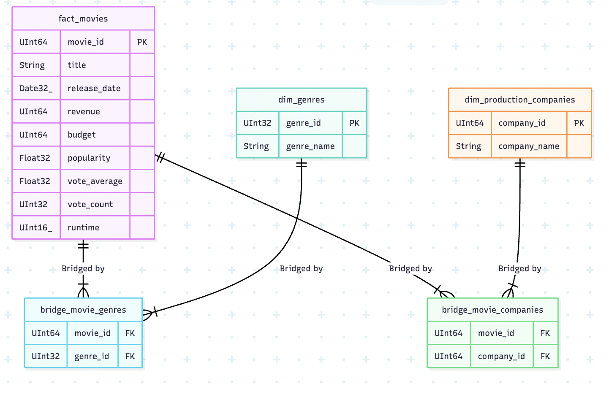

# ETL & Data Pipeline for TMDB Dataset

## 1. Project Overview
This project used for Qoala Take Home Test. All of the file including; dataset download, ETL code, and bash script to setup the project. Main objective of this project is building and setup the data pipeline to processing TMDB Dataset from Kaggle.
The pipeline performs the following key functions:
* **Automated Data Ingestion**: Downloads the dataset directly from Kaggle using its API.
* **Data Warehouse Construction**: Builds a star-schema data warehouse in ClickHouse, optimized for analytical queries.
* **ETL Processing**: Extracts data from JSON files, transforms it by cleaning data types and handling inconsistencies between movies and series, and loads it into the warehouse.

## 2. Tech Stack
* **Orchestration**: Apache Airflow
* **Data Warehouse**: ClickHouse
* **Transformation & Loading**: Python 3.8 (feat. `pandas`, `clickhouse-connect`)
* **Containerization**: Docker & Docker Compose

## 3. Data Warehouse Architecture & Schema


The data warehouse is designed using a **Star Schema**. This model was chosen because it is highly effective for analytical and BI queries, separating measurable facts from their descriptive context (dimensions).

The core schema consists of one fact table, two dimension tables, and two bridge tables to manage many-to-many relationships.

| Table Name                 | Type      | Description                                                                 |
| :------------------------- | :-------- | :------------------------------------------------------------------------ |
| `fact_movies`              | Fact      | The central table containing quantitative data like revenue, budget, and popularity. |
| `dim_genres`               | Dimension | Stores the unique list of all movie and series genres.                       |
| `dim_production_companies` | Dimension | Stores the unique list of all production companies.                   |
| `bridge_movie_genres`      | Bridge    | Manages the many-to-many relationship between movies and genres.      |
| `bridge_movie_companies`   | Bridge    | Manages the many-to-many relationship between movies and companies.   |

## 4. Data Pipeline Construction
The pipeline is built by two distinct Airflow DAGs to ensure a clear separation of concerns between data acquisition and data processing.

### `kaggle_downloader.py` - Data Ingestion
This initial DAG is responsible for populating the local data directory.
* **Task 1 (`set_kaggle_api_permissions`):** A `BashOperator` task that sets the correct file permissions (`600`) for the `kaggle.json` API key, which is a requirement for the Kaggle CLI to function securely.
* **Task 2 (`download_and_unzip_dataset`):** A `BashOperator` that executes the Kaggle CLI command to download the dataset and unzip it directly into the shared `/data` volume.

### `etl_tmdb_to_dwh.py` - ETL and Data Mart
This is the main pipeline that processes the data and create the DWH tables. It runs in three stages:

* **Task 1 (`create_dwh_tables`):** This task connects to ClickHouse and executes a series of `CREATE TABLE IF NOT EXISTS` statements to create a lists of DWH tables.

* **Task 2 (`extract_transform_load`):** This is the core ETL logic
    * **Extract**: The task recursively scans the `/data` directory using Python's `glob` library to find all `.json` files within the `movies` and `series` sub-folders.
    * **Transform**: Using the `pandas` library, the task iterates through up to 3,000 files. For each valid entry, it performs several transformations:
        * Handles both movies (which use the `title` field) and series (which use the `name` field).
        * Parses date strings (`release_date`, `first_air_date`) into proper date objects, handling invalid formats and null values gracefully. The DWH schema uses `Date32` to accommodate dates before 1970.
        * Prepares separate lists of data for each target table (facts, dimensions, and bridges).
        * For dimension data, it renames columns (e.g., API's `id` to `genre_id`) and selects only the necessary columns to match the target table schema, preventing load errors.
    * **Load**: The task uses the `clickhouse-connect` library to perform efficient bulk inserts of the cleaned pandas DataFrames into the corresponding ClickHouse tables.

## 5. Setup and Usage Instructions
Follow these steps to set up and run the project locally.

### Prerequisites
* Docker
* Docker Compose

### Configuration
1.  **Kaggle API Key**: Obtain your `kaggle.json` API key from your Kaggle account page (`Account` -> `API` -> `Create New Token`). Place this file in the root directory of the project.
2.  **Setup Bash Script**: There's bash script named `setup.sh` to setup the initial 

### Running the Environment
1. Navigate to the project's root directory in your terminal.
2. Execute the following command to build the images and start all services in the background:
   ```bash
   ./setup.sh
   ```
3. Wait a minute for the services to initialize. You can access the Airflow UI at **`http://localhost:8080`**. The default login credentials are: 
      - Username: `airflow`
      - Password: Generated by bash script or in `.env` file (AIRFLOW_PASSWORD)
4. Setup the ClickHouse connection in Airflow in `Connection` menu in navbar and fill with this following configuration:
      - Connection Id: `clickhouse_manual`
      - Connection Type: `Generic`
      - Host: `clickhouse-server`
      - Login: `default`
      - Password: Generated by bash script or in `.env` file (CLICKHOUSE_PASSWORD)
      - Port: `8123`

### Executing the Pipeline
The two pipelines must be run in order.

1.  **Run the Downloader**: In the Airflow UI, locate the `kaggle_downloader` DAG. Enable it using the toggle and trigger it by clicking the "Play" button. Wait for it to complete successfully.
2.  **Run the ETL Pipeline**: Once the data is downloaded, locate the `etl_tmdb_to_dwh` DAG. Before running, ensure you have created the required database connection in **Admin -> Connections** with the ID `clickhouse_manual` (see documentation above for details). Enable and trigger the DAG.

## 6. Try to Querying the DWH
1. Open your query editor such as `DBeaver` or `TablePlus`, add ClichHouse connection with this following:
   - Host: `localhost`
   - Port: `8123`
   - Database/Schema: `default`
   - Username: `default`
   - Password: Generated by bash script or in `.env` file (CLICKHOUSE_PASSWORD)
2. Run this following query:
```bash
SELECT
    g.genre_name,
    count(f.movie_id) AS total_movies,
    round(avg(f.vote_average), 2) AS avg_rating,
    sum(f.revenue) AS total_revenue
FROM fact_movies AS f
LEFT JOIN bridge_movie_genres AS b ON f.movie_id = b.movie_id
LEFT JOIN dim_genres AS g ON b.genre_id = g.genre_id
GROUP BY g.genre_name;
```